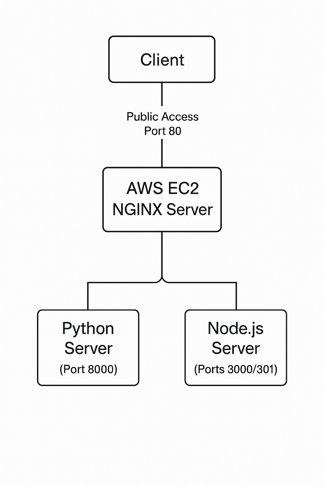
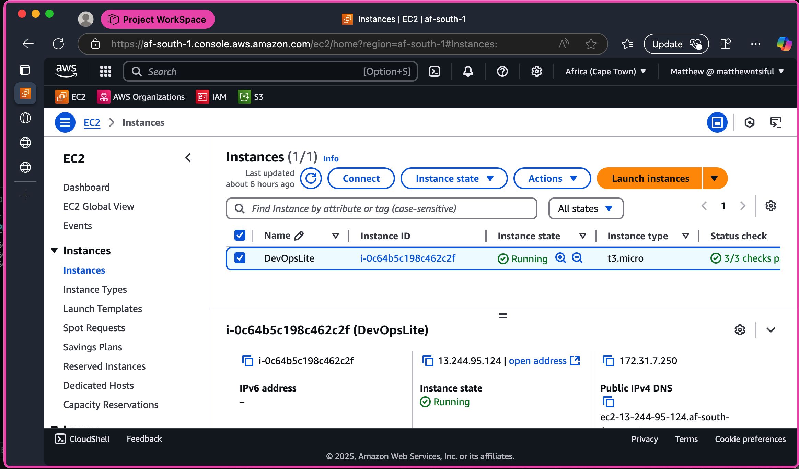
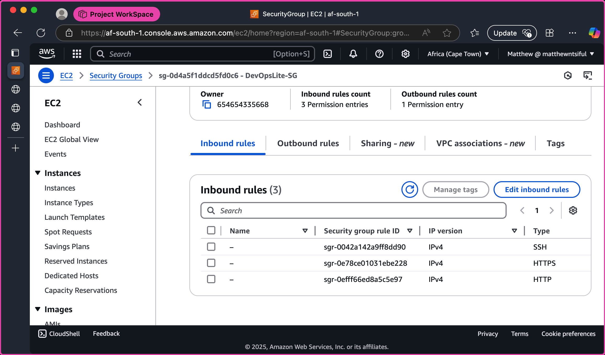

# DevOps Lite Project

## Project Overview

DevOps Lite is a hands-on project demonstrating essential DevOps practices including Linux system administration, Bash scripting, Git/GitHub version control, and Nginx configuration. The project implements a multi-service infrastructure with automated management and traffic routing on an AWS EC2 instance running Ubuntu Server 24.04 LTS.

This project showcases:
- System administration with user and group management
- Automation through Bash scripts and cron jobs
- Web traffic management with Nginx (reverse proxy and load balancing)
- Version control best practices with Git/GitHub

## System Architecture



```
                     ┌─────────────┐
                     │    Client   │
                     └──────┬──────┘
                            │
                            ▼
                    ┌───────────────┐
 Public Access      │     AWS EC2   │
 Port 80 ───────────►  NGINX Server │
                    └───────┬───────┘
                            │
                 ┌──────────┴──────────┐
                 │                     │
                 ▼                     ▼
        ┌─────────────────┐   ┌─────────────────┐
        │  Python Server  │   │  Node.js Server │
        │   (Port 8000)   │   │  (Ports 3000/   │
        │                 │   │     3001)       │
        └─────────────────┘   └─────────────────┘
```

## Repository Structure

```
DevOps-Lite/
├── README.md              # This file
├── docs/
│   └── design-overview.md # Detailed design documentation
├── scripts/
│   ├── setup_users.sh     # User and group management
│   ├── backup.sh          # Automated backup script
│   ├── monitor_disk.sh    # Disk usage monitoring
│   └── check_nginx.sh     # Nginx status checking
├── nginx-configs/
│   ├── reverse-proxy.conf # Python app reverse proxy config
│   └── load-balancer.conf # Node.js apps load balancing config
├── cron/
│   └── crontab-sample.txt # Scheduled tasks configuration
├── imgs/                  # Project screenshots and diagrams
│   ├── architecture/      # System architecture diagrams
│   ├── aws/               # AWS configuration screenshots
│   └── testing/           # Testing and verification screenshots
└── .gitignore             # Git exclusion patterns
```

## Implementation Details

### Module 1: Provisioning the Ubuntu EC2 Instance

**Instance Details:**
- EC2 Instance Type: t3.micro
- AMI: Ubuntu Server 24.04 LTS (HVM), EBS General Purpose (SSD) Volume Type
- Region: af-south-1 (Africa - Cape Town)

**Security Group Configuration:**
- SSH (Port 22): Allowed for administrative access
- HTTP (Port 80): Allowed for web traffic
- Custom TCP (Port 8000): Allowed for Python app access (closed after intitial connectivity test)
- Custom TCP (Port 3000 and 3001): Allowed for Node.js app access (closed after intitial connectivity test)

**Initial Setup:**
```bash
sudo apt update && sudo apt upgrade -y
sudo apt install git nginx curl -y
```

### Module 2: User, Group, and Permission Management

User and group management was implemented using a Bash script to create:

**Groups:**
- dev: Development team
- web: Web administration
- ops: Operations team

**Users:**
- devadmin: Member of dev group
- webadmin: Member of web group
- automation: Member of ops group

**Example of setup_users.sh:**
```bash
#!/bin/bash

# Check if script is run as root
if [[ $EUID -ne 0 ]]; then
  echo "ERROR: This script must be run as root. Use 'sudo ./setup_users.sh'." >&2
  exit 1
fi

# Create groups
addgroup --force-badname dev
addgroup --force-badname web
addgroup --force-badname ops

# Create users with home directories
adduser --disabled-password --gecos "" --ingroup dev devadmin
adduser --disabled-password --gecos "" --ingroup web webadmin
adduser --disabled-password --gecos "" --ingroup ops automation

# Create shared directory for developers
mkdir -p /opt/dev
chown devadmin:dev /opt/dev
chmod 770 /opt/dev

echo "User and group setup completed successfully."
```

### Module 3: Bash Scripting & Cron Job Automation

Three Bash scripts were implemented for system automation:

**1. Backup Script (`backup.sh`):**
- Creates daily backups of `/var/www`
- Implements backup rotation (keeps last 30 backups)
- Logs activities to `/var/log/backup.log`

**2. Disk Monitoring Script (`monitor_disk.sh`):**
- Checks disk usage against a threshold (75%)
- Logs warnings when usage exceeds the threshold

**3. Nginx Status Check Script (`check_nginx.sh`):**
- Verifies if Nginx is running
- Monitors service status and error logs

**Cron Jobs:**
Tasks were scheduled using cron:
```
# Run backup script daily at midnight (00:00)
0 0 * * * /home/ubuntu/DevOps-Lite/scripts/backup.sh

# Disk monitoring every hour (at the beginning of the hour)
0 * * * * /home/ubuntu/DevOps-Lite/scripts/monitor_disk.sh

# Check Nginx status every 5 minutes
*/5 * * * * /home/ubuntu/DevOps-Lite/scripts/check_nginx.sh
```

### Module 4: Git & GitHub Version Control

The project implemented version control using Git with:
- Structured repository organization
- Commit history tracking implementation progress
- GitHub remote repository for collaboration
- Documentation integrated with implementation code

**GitHub Repository:**
- User: MatthewNsiful
- Repository: DevOps-Lite

### Module 5: Nginx Setup -- Reverse Proxy and Load Balancing

Nginx was configured with two separate configurations:

**1. Reverse Proxy Configuration (`reverse-proxy.conf`):**
```nginx
server {
   listen 80;
   server_name ec2-13-244-95-124.af-south-1.compute.amazonaws.com;

   location /pythonapp/ {
      proxy_pass http://ec2-13-244-95-124.af-south-1.compute.amazonaws.com:8000/;
      proxy_set_header Host $host;
      proxy_set_header X-Real-IP $remote_addr;
   }
}
```

**2. Load Balancer Configuration (`load-balancer.conf`):**
```nginx
upstream nodejsapp {
    server ec2-13-244-95-124.af-south-1.compute.amazonaws.com:3000;
    server ec2-13-244-95-124.af-south-1.compute.amazonaws.com:3001;
}

server {
    listen 80;
    server_name ec2-13-244-95-124.af-south-1.compute.amazonaws.com;

    location / {
        proxy_pass http://nodejsapp;
        proxy_set_header Host $host;
        proxy_set_header X-Real-IP $remote_addr;
    }
}
```

## Backend Services

The project includes multiple web services to demonstrate traffic routing:

### Python Application (Port 8000)
A simple HTTP server providing a static webpage accessed through the `/pythonapp/` path.

### Node.js Applications (Ports 3000 and 3001)
Two identical Node.js applications that display different port numbers, used to verify load balancing functionality.

## Testing and Verification

The implementation was tested through:

1. **User Management Verification:**
   - Confirmed user creation and proper group membership
   - Verified directory permissions

2. **Script Execution:**
   - Ran each automation script manually to verify functionality
   - Checked log outputs for expected results

3. **Nginx Configuration Testing:**
   - Verified reverse proxy functionality by accessing the Python application
   - Confirmed load balancing by observing alternating responses from Node.js applications
   - Tested with direct port access and through Nginx

## Challenges and Solutions

**Challenge:** Configuring multiple services for testing both reverse proxy and load balancing.

**Solution:** Implemented in phases:
1. Set up individual services and verified direct access
2. Configured Nginx for both reverse proxy and load balancing in separate files
3. Tested each configuration independently
4. Secured the services by restricting direct access

## Design Decisions

### Why Nginx for Reverse Proxy and Load Balancing?

Nginx was selected due to:
- High performance and low resource requirements
- Built-in support for both reverse proxy and load balancing
- Extensive configuration options
- Production-grade reliability

### Why Separate Configuration Files?

Separate configurations for reverse proxy and load balancing provide:
- Better modularity and maintainability
- Independent testing capabilities
- Simplified troubleshooting
- Demonstration of different Nginx configuration patterns

### Why Bash for Automation?

Bash scripting was chosen because:
- Universal availability on Linux systems
- Direct system command access
- Simple integration with cron
- Efficiency for system administration tasks

## Future Enhancement Possibilities

The project can be extended with:

1. **Security Improvements:**
   - SSL/TLS implementation
   - UFW firewall configuration
   - Enhanced authentication

2. **Monitoring and Alerting:**
   - Integration with monitoring tools
   - Performance metrics collection
   - Automated alerting

3. **Deployment Pipeline:**
   - CI/CD integration
   - Zero-downtime deployment strategy
   - Container orchestration

## Screenshots

### AWS EC2 Instance


### Security Group Configuration


### Testing Results


## Conclusion

This DevOps Lite project successfully demonstrates fundamental DevOps practices through:

1. **Infrastructure Management:** EC2 instance provisioning and configuration
2. **System Administration:** User, group, and permission management
3. **Automation:** Bash scripting and task scheduling
4. **Web Service Management:** Nginx configuration for traffic routing
5. **Version Control:** Structured repository with Git and GitHub

The implementation provides a foundation for understanding how various DevOps components work together to create a functional, maintainable, and secure web infrastructure.
